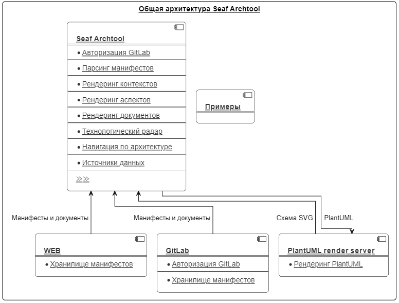
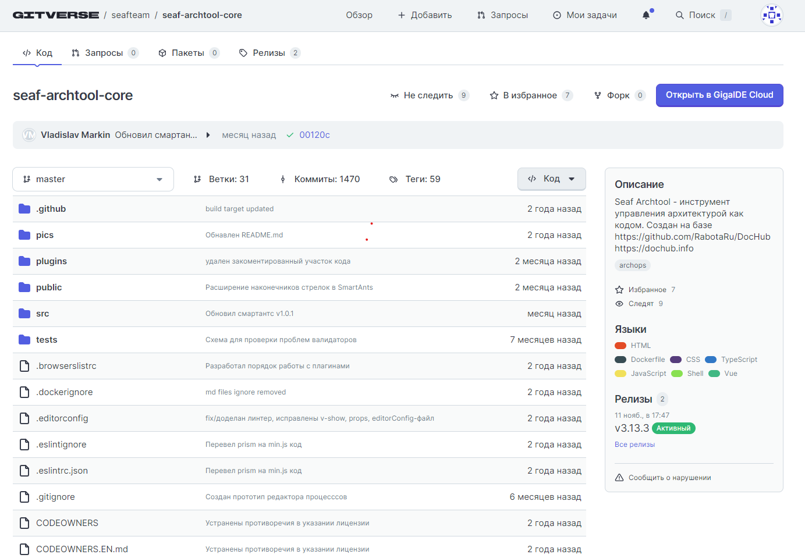
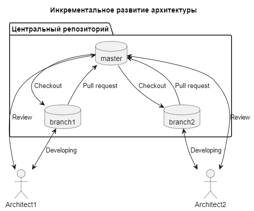
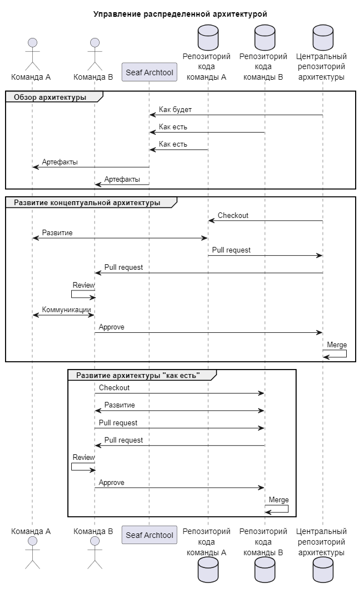
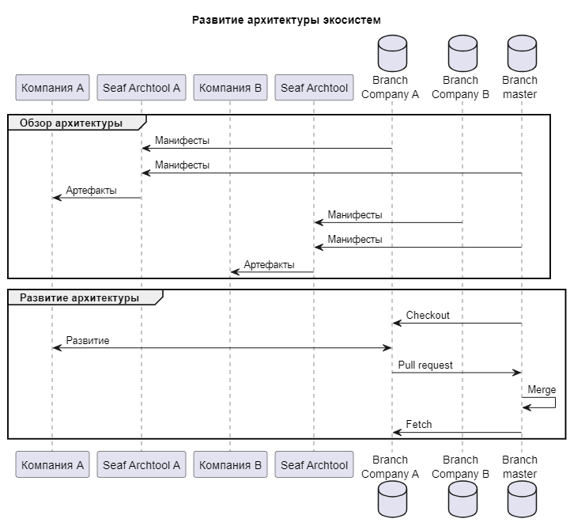
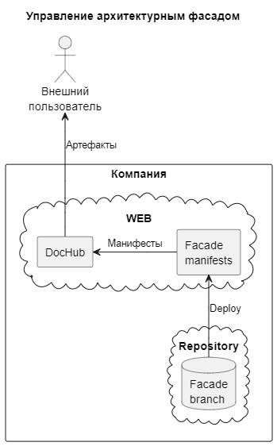
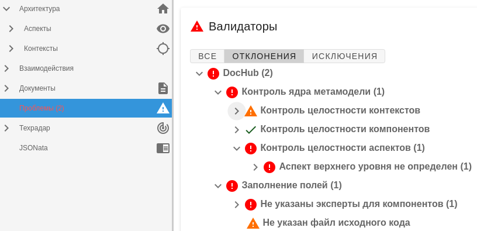

# Seaf Archtool
#### Добро пожаловать в Seaf Archtool — решение для управления цифровой архитектурой. 
### Применение
Seaf Archtool — продукт, предназначенный для выполнения следующих задач:
- Описание цифровой архитектуры. Мы считаем, что достичь ее можно описывая архитектуру кодом.
- Повышение архитектурной зрелости компании группы "Сбер".
- Экспертиза архитектурных решений, обеспечивая тем самым соответствие этих решений установленным стандартам и стратегическим направлениям банка.

#### Наш подход включает:
1. Исследование кейсов, возникающих перед бизнесами и IT, формирование выверенных примеров описания и управления архитектурой (разработка и экспертиза артефактов), выявление лучших практик, обучение, референс, сопровождение и консалтинг.
2. Архитектурную работу c применением SEAF в организациях Группы Сбер, Банке или внешней организации-партнере, приносящую ценность бизнесу, поддерживаемую Сообществом и демонстрирующую во внешнюю среду успешную историю развития участника Сообщества.
3. Разработку и внедрение архитектурных стандартов — мы создаем и тиражируем стандарты среди ДЗО, что значительно повышает зрелость информационных технологий.
4. Проведение контроля архитектур на соответствие установленным стандартам с целью обеспечить оптимальность принимаемых решений.
5. Развитие сообщества архитекторов, что позволяет обмениваться опытом и иными ресурсами между ДЗО.

Мы используем практические кейсы, которые доказали, что целостный и системный подход к архитектуре способствует повышению качества принимаемых решений. Путем управления архитектурой и внедрения стандартов, мы не только повышаем зрелость информационных технологий, но и создаем условия для обмена опытом среди участников Сообщества. 
### Инструмент
SEAF Archtool - инструмент управления архитектурой как кодом. Создан на базе https://github.com/DocHubTeam/DocHub.
Документация: https://dochub.info. 

#### Векторы Seaf Archtool, отличные от Dochub
- Поддержка цифровых архитектурных шаблонов и фреймворков, разрабатываемых в Сбере (SEAF, КА ДЗО, Ассессменты и др.)
- Поддержка Enterprise режимов использования инструмента SEAF.Archtool (бекэнд режим, в k8s, ролевая модель и т.п.)
- Обеспечение уровня безопасности продукта (обязательные проверки на уязвимости инструментами Сбера перед выпуском релиза)
- Поддержка практик развития архитектурной функции в Группе Сбера

Код архитектуры - ансамбль файлов на языках,решающих задачу описания. Поддерживаются:

* [PlantUML](https://plantuml.com/) - позволяет создавать диаграммы, используя простой и интуитивно понятный язык;
* [Mermaid](https://mermaid-js.github.io/mermaid/#/) - позволяет создавать диаграммы с использованием кода;
* [Markdown](https://ru.wikipedia.org/wiki/Markdown) - язык разметки, созданный с целью обозначения форматирования в тексте;
* [Swagger](https://swagger.io/) - язык описания HTTP API контрактов;
* [AsyncAPI](https://www.asyncapi.com/) - язык описания событийных контрактов;

Поддерживаемые языки:
- HTML
- Dockerfile
- CSS
- TypeScript
- JavaScript
- Shell
- Vue
### Общая архитектура SEAF Archtool


Решаемые проблемы:

* [Управление версиями](#versions);
* [Децентрализованное управление архитектурой в Agile-ориентированных компаниях](#decentralized);
* [Управление архитектурой экосистемы](#ecosystem);
* [Создание архитектурных фасадов (портал документации)](#facade);
* [Анализ архитектуры](#analysis);
* [Контроль консистентности](#problems);
* [Расширяемая метамодель](#extmetamodel).

## Быстрый старт

Рекомендуется начать с прочтения статьи [Архитектура рядом с кодом](https://habr.com/ru/post/659595/).
Познакомиться с работой инструмента и его подробной документацией можно на сайте 
[https://dochub.info](https://dochub.info/). 
Примеры использования можно найти в специальном репозитории, который развивает 
сообщество - [Примеры DocHub](https://github.com/rpiontik/DocHubExamples). Также полезно
посмотреть [воркшоп](https://youtu.be/A7U4KiE5uhQ) по старту использования.

Свежие версии плагинов лежат:
1. Для IDEA в [проекте](https://gitverse.ru/seafteam/seaf-archtool-core)
2. Для VSCode в [маркете VSCode](https://marketplace.visualstudio.com/items?itemName=DocHub.dochub)

В качестве хранилища для репозиториев Seaf Archtool использует GitVerse - https://gitverse.ru/seafteam/seaf-archtool-core.



[Принципы развития продукта](#manifest)

## <a name="versions"></a> Управление версиями архитектуры

Seaf Archtool позволяет развивать кодовую базу архитектуры аналогично кодовой базе приложений. В качестве системы управления
версиями используется Git.



## <a name="decentralized"></a> Децентрализованное управление архитектурой в Agile-ориентированных компаниях

Seaf Archtool умеет консолидировать описание архитектуры из различных источников. Например, из разных репозиториев. Это
позволяет командам действовать независимо в сотрудничестве друг с другом.



## <a name="ecosystem"></a> Управление архитектурой экосистем

Seaf Archtool позволяет создать единое информационное пространство для экосистемы. Стимулирует положительную синергию продуктов.



## <a name="facade"></a> Архитектурные фасады

Seaf Archtool хорошо решает задачу публичного портала документации.




## <a name="analysis"></a> Анализ архитектуры

Один из ключевых принципов инструмента - Архитектура как данные. Это означает, что вы можете
получать ценные для себя сведения из архитектуры, используя язык запросов [JSONata](https://jsonata.org/).

## <a name="problems"></a> Контроль консистентности архитектуры

Seaf Archtool умеет находить проблемы в описании архитектуры и контролировать определенные вами правила.



## <a name="extmetamodel"></a> Расширяемая метамодель

Метамодель Seaf Archtool может быть расширена по вашему желанию. Есть возможность как модифицировать
уже существующие сущности, так и создавать собственные.
Пример можно посмотреть [здесь](https://gitverse.ru/seafteam/seaf-dzo-core)


## Развертывание

### Конфигурирование

Определите необходимые переменные окружения. Используйте файл примера [example.env](example.env) для этого. Переименуйте его для
продакшен окружения в ".env" для локального развертывания в ".env".

Если вы ничего не будете трогать, развертывание произойдет с дефолтными настройками. В этом случае Seaf Archtool будет
содержать собственную документацию.

### Локальное развертывание

Выполните команды:
```
docker-compose up --build
```
Seaf Archtool станет доступен по адресу [http://localhost:8080/main](http://localhost:8080/main)

### Сборка из исходников для продакшен

Проект является VueJS SPA приложением. В качестве backend пользуется GitLab.

Для развёртывания потребуется стандартная сборка VueJS приложения средствами npm, версией не ниже 8.1.х (версия node 20.х.х).
```
npm сi
npm run build
```

В результате будут сгенерированы статические файлы в папке /dist. Их необходимо
опубликовать используя web-сервер. Например, nginx.

Подробнее о вариантах развертывания можно узнать [тут](https://cli.vuejs.org/ru/guide/deployment.html).

## Интеграция с GitLab
### Для локального развертывания
В файле "example" укажите адрес GitLab в соответствующей переменной:
```
VUE_APP_DOCHUB_GITLAB_URL=https://foo.space
```

В GitLab **под своей учетной записью** выпустите персональный токен Profile->Preferences->Access Tokens


Полученный токен укажите в файле ".env" в переменной:
```
# Персональный токен gitlab. Используется для локальной разработки
VUE_APP_DOCHUB_PERSONAL_TOKEN=9H...FR
```

Перезапустите контейнеры:
```
docker-compose down
docker-compose up --build
```

### Локальное развитие архитектуры

Создайте папку "/public/workspace". Папка входит в .gitignore. Это нормально. Папка предназначена для
локального развертывания архитектурных репозиториев. Клонируйте необходимый архитектурный репозиторий.

```
cd /public/workspace
git clone git@git.foo.space:repo.git
```

Определите в ".env" переменную корневого манифеста:

```
VUE_APP_DOCHUB_ROOT_MANIFEST=workspace/repo/root.yaml
``` 

Перезапустите контейнеры:

```
docker-compose down
docker-compose up --build
```

Теперь вы можете вносить изменения в репозиторий локально и видеть результат изменений в режиме реального времени.


Следите за новостями в [группе комьюнити](https://t.me/archascode) и нашем [канале](https://t.me/dochubchannel).

# Статьи
* [Архитектура как кот VS Архитектура как кол](https://habr.com/ru/company/rabota/blog/578340/);
* [Архитектура как данные](https://habr.com/ru/post/593009/);
* [Архитектура рядом с кодом](https://habr.com/ru/post/659595/);
* [Код архитектуры — это жидкость](https://habr.com/ru/post/701050/);
* [Кто последний на индустриальный стандарт? Мне только спросить…](https://habr.com/ru/post/713534/);

# Воркшопы
* [Старт использования](https://youtu.be/A7U4KiE5uhQ)
* [Ванильная метамодель DocHub](https://youtu.be/reuVl9rQyXM)
* [Реверс-архитектура](https://youtu.be/yp4PgZUYBZY)
* [Опыт ГК Самолет](https://youtu.be/8nMWWaw_GYQ)
* [Кастомизация метамодели](https://youtu.be/57LxueZy0mc)

# Доклады
* [Доклад "Архитектура как код" на FlowConf 2023](https://www.youtube.com/watch?v=B7IqUR9yb0w);
* [Доклад "Архитектура как код" на ArchDays 2022](https://www.youtube.com/watch?v=gLsKxWjRPoI);
* [Круглый стол 2021](https://youtu.be/tGulYbKW_Lg).

# Сообщество

* [Группа DocHubTeam](https://t.me/archascode)
* [Канал "Архитектура как код"](https://t.me/dochubchannel)

# Лицензия
DocHub распространяется под лицензией Apache License 2.0 Open source license.
